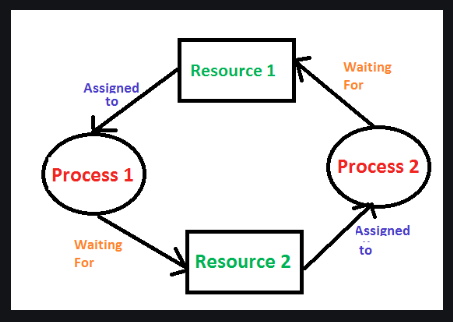

liveness: khả năng thực thi kịp thời của một concurrent application được biết đến là tính liveness của nó.

bài viết này tìm hiểu về 3 vấn đề trong liveness:
- [deadlock](#deadlock): phổ biến nhất
- [starvation and livelock](#starvation-and-livelock)
***
## dead lock
mô tả hai hay nhiều thread bị blocked mãi mãi, đợi chờ lẫn nhau.

Ví dụ từ ảnh trên:
- process 1 đang nắm giữ resource 1 và đợi resource 2 để hoàn tất quá trình thực hiện có nó, sau đo nó mới nhả resource 1 ra
- trong lúc đó: process 2 đang nắm giữ resource 2 và cũng đang đợi resource 1
dẫn đến chúng đợi chờ lẫn nhau mãi mãi, vì không cái nào có thể hoàn thành được để nhả tài nguyên mình đang nắm giữa ra.

Ví dụ với [code java](./src/deadlock/Deadlock.java). 

Thứ tự sẽ là:
- thread t1 gọi `alphonse.bow(gaston);` giữ lock đối với alphonse object vì nó truy cập vào synchronized method của đối tượng này và đợi lock của đối tượng gaston object để chạy bowBack()
- thread t2 gọi `gaston.bow(alphonse);` giữ lock đối với gaston object, tương tự nó cũng đợi lock của alphonse object để thực hiện bowBack()
- thread này đợi thread kia nhả object mình cần nên không thread nào hoàn thành được task để nhả ra, dẫn tới đợi chờ nhau mãi mãi.

Ngoài ra trong ví dụ cũng tái hiện khái niệm re-entrant sychronization khi gọi liên tiếp 2 synchronized method.