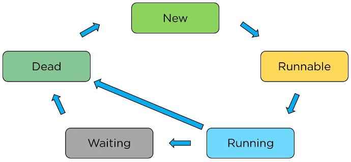

Lifecyle của một thread
- NEW: khởi tạo thread, code chưa được chạy và execution process chưa được khởi tạo
- Runnable: assign thread cho một task nhưng chưa thực sự chạy
- Running: thực thi task cho đến khi hoàn thành
- Waiting: các process có thể phụ thuộc lẫn nhau dẫn đến chúng có thể phải đợi nhau để hoàn thành task
- Dead: kết thúc thread do JVM quản lý

***
Multithreading in Java?

Khi thực thi một complex task nó sẽ chạy một tập các thread simultaneously, mỗi thread thuộc về java.lang.Thread class và thread sẽ ghi đè phương thức run() để thực thi yêu cầu.

Một số phương thức trong Java:
<table>
<tr>
<td>start()</td>
</tr>
<tr>
<td>currentThread()</td>
</tr>
<tr>
<td>run()</td>
</tr>
<tr>
<td>isAlive()</td>
</tr>
<tr>
<td>sleep()</td>
</tr>
<tr>
<td>yield()</td>
</tr>
<tr>
<td>suspend()</td>
</tr>
<tr>
<td>resume()</td>
</tr>
<tr>
<td>interrupt()</td>
</tr>
<tr>
<td>destroy()</td>
</tr>
<tr>
<td>stop()</td>
</tr>
</table>

***
Khởi tạo một thread có hai cách:
- extend Thread class
- implement Runnable interface

*Chú ý*
- ưu tiên sử dụng cách 2 vì nó tổng quát hơn, linh hoạt hơn. Runnable object có thể là lớp con của lớp khác ngoài Thread class
- cho phép tách biệt task được định nghĩa bởi Runnable và việc thực thi luồng bới một Thread object
***