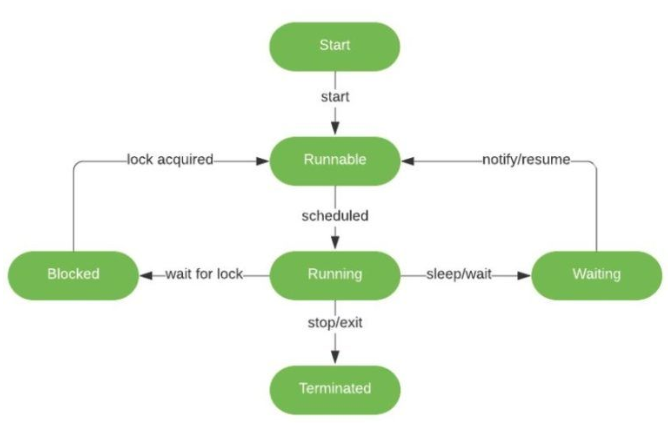

Lifecyle của một thread
- Start: khởi tạo thread, code chưa được chạy và execution process chưa được khởi tạo
- Runnable: assign thread cho một task nhưng chưa thực sự chạy
- Running: thực thi task cho đến khi hoàn thành
- Waiting: các process có thể phụ thuộc lẫn nhau dẫn đến chúng có thể phải đợi nhau để hoàn thành task
- Terminated: kết thúc thread do JVM quản lý
- Blocked

[Source](https://www.baeldung.com/java-interrupted-exception#:~:text=An%20InterruptedException%20is%20thrown%20when,in%20Java%20can%20throw%20it.)
***
Multithreading in Java?

Khi thực thi một complex task nó sẽ chạy một tập các thread simultaneously, mỗi thread thuộc về java.lang.Thread class và thread sẽ ghi đè phương thức run() để thực thi yêu cầu.

Một số phương thức trong Java:
<table>
<tr>
<td>start()</td>
<td>

Đơn giản như cái tên, nhìn quá lifecycle để hiểu hơn
- Khi chạy một chương trình Java, một thread sẽ được JVM khởi tạo gọi là `Main Thread`, cùng với một số `daemon thread` chạy ngầm với độ ưu tiên thấp khác. 
- `Main Thread` này sẽ đi tìm phương thức main và thực thi code trong đó.
</td>
</tr>
<tr>
<td>currentThread()</td>
<td>
</td>
</tr>
<tr>
<td>run()</td><td></td>
</tr>
<tr>
<td>isAlive()</td><td></td>
</tr>
<tr>
<td>sleep()</td>
<td>

Thread.sleep() được dùng để tạm ngưng quá trình của thread hiện tại trong một khoảng thời gian
- Thời gian không thể là số âm nếu không sẽ báo lỗi IllegalArgumentException.
- Thread sẽ được gán cho trạng thái **WAITING** tương ứng trong lifecycle.
- Hết khoảng thời gian chờ sẽ chuyển sang trạng thái Runnable.
- Khoảng thời gian chờ thực sự sẽ >= thời gian sleep phụ thuộc vào bộ lập và bộ hẹn giờ của hệ thống, nếu hệ thống đang bận thì có thể hết thời gian sleep mà hành động của thread vẫn chưa được thực thi.
- Một *InterruptException* sẽ được ném ra khi một thread bị interrupted trong khi nó đang waiting, sleeping hoặc bị chiếm giữ vì vậy khi dùng sleep() phải throw ngoại lệ này.

*Note*:
- Chúng ta có thể tuỳ chỉnh để xử lý ngoại lệ, trong demo mình tái hiện exception khi gọi interrupt()

Mình sẽ bổ sung phần handle exception sau
</td>
</tr>
<tr>
<td>yield()</td><td></td>
</tr>
<tr>
<td>suspend()</td><td></td>
</tr>
<tr>
<td>resume()</td><td></td>
</tr>
<tr>
<td>interrupt()</td>
<td>
Phương thức này biểu thị một thread nên dừng việc nó đang làm để làm một việc khác, về cách phản ứng của thread với phương thức này người lập trình có thể định nghĩa nó thông qua việc catch InterruptException trong run() method hoặc throw ra exception cho phương thức sử dụng nó xử lý.

Bên cạnh `void interrupt()` method dùng để làm giãn đoạn một thread, chúng ta còn có thêm 2 phương thức phụ trợ nữa:
- [boolean isInterrupted()](./src/interrupt/InterruptWithThrowsException.java): kiểm tra xem current thread có bị giãn đoạn hay không, mà nó không thay đổi giá trị flag, mà chỉ kiểm tra trạng thái. Uncommed `1` trong ví dụ để thấy sự khác biệt.
- `boolean interrupted()`: giống cái trên chỉ có một điều khác biệt là nó sẽ thay đổi giá trị flag về false, nghĩa là nếu trước đó gọi interrupt() (lúc này giá trị flag của thread là true), sau đó gọi interrupted() thì nó lại set về false.
</td>
</tr>
<tr>
<td>destroy()</td><td></td>
</tr>
<tr>
<td>stop()</td><td></td>
</tr>
</table>

***
Khởi tạo một thread có hai cách:
- extend Thread class
- implement Runnable interface

*Chú ý*
- ưu tiên sử dụng cách 2 vì nó tổng quát hơn, linh hoạt hơn. Runnable object có thể là lớp con của lớp khác ngoài Thread class
- cho phép tách biệt task được định nghĩa bởi Runnable và việc thực thi luồng bới một Thread object
***